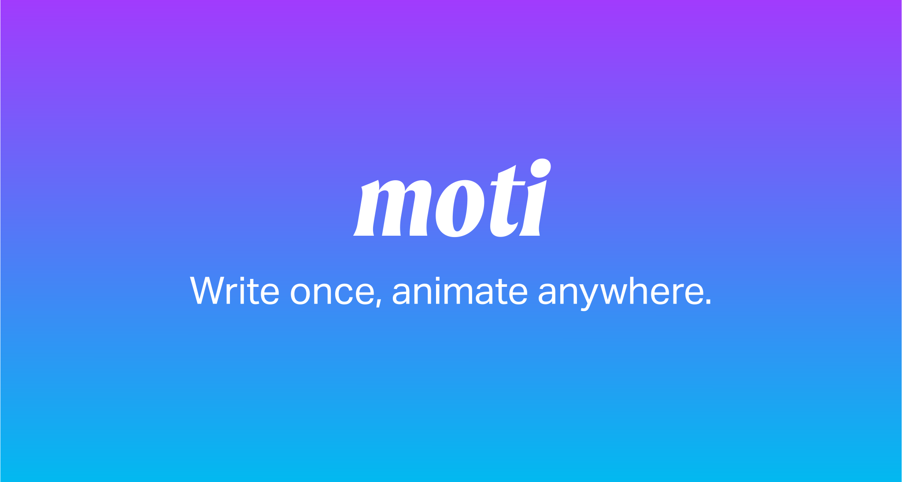

# Moti

RN 작업 중 Moti 라이브러리를 사용하다, 애니메이션 일시정지가 동작하지 않는 것을 발견했습니다.

reanimated 라이브러리를 wrapping하여 만든 라이브러리이고 reanimated는 cancelAnimation() api를 제공하고 있기 때문에 이상하다고 생각했습니다.

```jsx
// test code

import React from "react";
import { View, Button } from "react-native";
import { MotiView, useDynamicAnimation } from "moti";
import { useSharedValue } from "react-native-reanimated";

export default function App() {
  const scale = useSharedValue(0);
  const animation = useDynamicAnimation(() => ({
    transform: [{ scale: 0 }],
  }));

  const toggleAnimation = () => {
    scale.value = scale.value === 0 ? 1 : 0;
    animation.animateTo({
      transform: [{ scale: scale.value }],
      transition: {
        duration: 3000,
      },
    });
  };

  const pauseAnimation = () => {
    animation.animateTo({
      transform: [{ scale: scale.value }],
      transition: {
        duration: 0,
      },
    });
  };

  return (
    <View style={{ flex: 1, justifyContent: "center", alignItems: "center" }}>
      <MotiView
        state={animation} // useDynamicAnimation 상태 전달
        style={{
          width: 100,
          height: 100,
          backgroundColor: "blue",
        }}
      />
      <View style={{ marginTop: 20 }}>
        <Button title="Toggle Animation" onPress={toggleAnimation} />
        <Button title="Pause Animation" onPress={pauseAnimation} />
      </View>
    </View>
  );
}
```

그래서 직접 useSharedValue와 useDynamicAnimation()훅을 혼합해서 사용했으나 일시정지가 아닌 animation.ToAnimation() value로 이동하는 것을 확인했습니다.

<div align="center">

</div>

Fernando Rojo가 만든 RN 전용 애니메이션 라이브러리

기본 사용

```jsx
<MotiView
	from={{ opacitiy: 0}}
	animate={{ opacity: 1}}
	exit={{. opacity: 0 }}
/>
```

### 철학

애니메이션을 추가하는 작업은 **배경색을 추가하는 것만큼 간단해야한다.**

그러기 위해 분리된 Reacnimated의 hook들을 단일 컴포넌트로 추상화한 라이브러리

단순히 스타일 객체를 전달하기만 하면 컴포넌트가 알아서 작업해준다.

→ 중요한점. Moti를 개선하려면 새로운 hook을 만들어서 분리하는 것이 아니라 props로 전달해야 한다.

### 동작 방법

기존 Reanimated 방법

```jsx
function FadeEffect() {
  const opacity = useSharedValue(0);

  useEffect(() => {
    opacity.value = withTiming(1);
  }, []);

  const animatedStyle = useAnimatedStyle(() => {
    return {
      opacity: opacity.value,
    };
  });

  return <Animated.View style={animatedStyle} />;
}
```

Moti

```jsx
// Not your regular react-native View
import { View } from "moti";
function FadeEffect() {
  return <View from={{ opacity: 0 }} animate={{ opacity: 1 }} />;
}
```

혹은 순차적인 애니메이션 흐름도 부여 가능

```jsx
<View animate={{ opacity: [0, 1, 0] }} />
```

Moti는 이러한 로직을 이면에서 처리함으로써 개발경험을 향상시킨다.

그러나 애니메이션을 특정 상황에서 트리거 하려면 결국 분리해야 한다.

```jsx
function TextField() {
  const [text, setText] = useState("");

  const animationState = useAnimationState({
    success: {
      borderColor: "green",
    },
    fail: {
      borderColor: "red",
    },
  });

  useEffect(() => {
    if (text === "password") {
      animationState.transitionTo("success");
    } else {
      animationState.transitionTo("fail");
    }
  }, [text]);

  return (
    <MotiTextInput state={animationState} value={text} onChangeText={setText} />
  );
}
```

Moti code level 분석

1. 컴포넌트 생성

MotiView

```jsx
export { View as MotiView } from "./view";
```

MotiView는 ./view에서 가져오고 있다.

```jsx
import { View as RView } from "react-native";

import { motify } from "../core";

export const View = motify(RView)();
```

그리고 ./view로 들어가보면 motify라는 고차함수에 view 컴포넌트를 전달해서 export 하고 있다.

그래서 ‘core/motify.tsx’ 에서 확인을 해봤다.

```jsx
export default function motify<
  Props extends object,
  Ref,
  Animate = ViewStyle | ImageStyle | TextStyle
>(ComponentWithoutAnimation: ComponentType<Props>) {
  const Component = Animated.createAnimatedComponent(
    ComponentWithoutAnimation as FunctionComponent<Props>
  )
```

여기서 부터 reanimated의 라이브러리들이 사용되기 시작한다.

전달받은 component를 Animated.createAnimatedComponent를 통해 변환한다.

`createAnimatedComponent`는 reanimated 라이브러리에서 RN 컴포넌트를 Animated 버젼으로 전환시키는 함수다.

- `Animated.FlatList`
- `Animated.Image`
- `Animated.View`
- `Animated.ScrollView`
- `Animated.Text`

위 다섯가지를 기반으로 변형한다.

그리고 이렇게 생성된 `Component` 는 내부의 withAnimations를 통해서 animation 속성을 부여받는다.

```jsx
const withAnimations = () => {
    const Motified = forwardRef<
      Ref,
      Props &
        AnimatedProps<Props> &
        MotiProps<Animate> & {
          children?: React.ReactNode
        }
    >(function Moti(props, ref) {
      const animated = useMotify({
        ...props,
        usePresenceValue: usePresence(),
        presenceContext: useContext(PresenceContext),
      })

      const style = (props as any).style

      return (
        <Component
          {...(props as any)}
          style={style ? [style, animated.style] : animated.style}
          ref={ref as any}
        />
      )
    })
```

여기서 사용되는 ref는 Moti 라이브러이이 useAnimationState api를 연결하기 위함이다.

그리고 함수 내부에서 `animated`를 사용해서 style에 전달해주고 있다.

그리고 animated는 `useMotify()`의 return 값이다.

여기에서 전달되는 인수는

`import { usePresence, PresenceContext } from 'framer-motion’`

framer-motion의 hook들을 사용한다.

일단 useMotify 함수부터 분석했다.

```jsx
//./src/core/use-motify.ts

export function useMotify<Animate>({
  animate: animateProp,
  from: fromProp = false,
  transition: transitionProp,
  exitTransition: exitTransitionProp,
  delay: defaultDelay,
  state,
  stylePriority = 'animate',
  onDidAnimate,
  exit: exitProp,
  animateInitialState = false,
  usePresenceValue,
  presenceContext,
}: MotiProps<Animate> & {
  presenceContext?: Pick<
    NonNullable<React.ContextType<typeof PresenceContext>>,
    'custom' | 'initial'
  > | null
  usePresenceValue?: ReturnType<typeof useFramerPresence>
}) {
  const isMounted = useSharedValue(false)
  const [isPresent, safeToUnmount] = usePresenceValue ?? []
```

여기서 부터 reanimated의 주요 hook들이 보이기 시작한다.

일단 animation 값을 조정하는 useSharedValue를 사용해서 isMounted를 선언한다.

최종 return 값은 `{ style }` 이다.

그리고 그 style은 내부에서 useAnimatedStyle을 통해서 선언된다.

```jsx
const style = useAnimatedStyle(() => {
```

`useAnimated`

style 객체를 생성한다. `StyleSheet`와 비슷하며 shared values를 사용해 애니에이션을 구현할 수 있다.

예시

```jsx
export default function App() {
  const translateX = useSharedValue < number > 0;

  const handlePress = () => {
    translateX.value += 50;
  };

  const animatedStyles = useAnimatedStyle(() => ({
    transform: [{ translateX: withSpring(translateX.value * 2) }],
  }));

  return (
    <>
      <Animated.View style={[styles.box, animatedStyles]} />
      <View style={styles.container}>
        <Button onPress={handlePress} title="Click me" />
      </View>
    </>
  );
}
```

```jsx
const variantStyle: Animate & WithTransition = state?.__state?.value || {}

// ...중략

let mergedStyles: Animate = {} as Animate
    if (stylePriority === 'state') {
      mergedStyles = Object.assign({}, animateStyle, variantStyle)
    } else {
      mergedStyles = Object.assign({}, variantStyle, animateStyle)
    }
```

그리고 여기서 transion과 animate 관련 값을 variatStyle에 선언한다.

그리고 Object.assign에서 stylePriority 의 상태에 따라서 인수 전달 순서를 달리해서 css 변경을 구현한다.

default value는 `stylePriority = 'animate',`animate로 전달받는다.

transition관련 속성도 여기서 선언한다.

```jsx
// allow shared values as transitions
let transition: MotiTransition<Animate> | undefined;
if (transitionProp && "value" in transitionProp) {
  transition = transitionProp.value;
} else {
  transition = transitionProp;
}

// let the state prop drive transitions too
if (variantStyle.transition) {
  transition = Object.assign({}, transition, variantStyle.transition);
}
```

가장 중요한 점은 cancelAnimation() api를 사용하기 위해서 useTiming같은 hook이 어디서 정의 되는 지 확인해야 한다.

```jsx
const {
  animation,
  config,
  reduceMotion,
  shouldRepeat,
  repeatCount,
  repeatReverse,
} = animationConfig(key, transition);
```

animation 종류는 `animationConfig()`에서 선언되어 나온다.

```jsx
function animationConfig<Animate>(
  styleProp: string,
  transition: MotiTransition<Animate> | undefined
) {
  'worklet'

  const key = styleProp as Extract<keyof Animate, string>
  let repeatCount = 0
  let repeatReverse = true

  let animationType: Required<TransitionConfig>['type'] = 'spring'
  if (isColor(key) || key === 'opacity') animationType = 'timing'

  const styleSpecificTransition = transition?.[key as any]

    if (styleSpecificTransition?.type) {
    animationType = styleSpecificTransition.type
  } else if (transition?.type) {
    // otherwise, fallback to transition.type
    animationType = transition.type
  }
```

기본 애니메이션 타입은 ‘spring’ 그리고 색이나 투명도 관련은 timing으로 간주한다.

그리고 타입이 사용자에 의해 전달되었다면 그 타입으로 지정한다.

```jsx
if (animationType === "timing") {
  //..생략
  animation = withTiming;
} else if (animationType === "spring") {
  animation = withSpring;
  //..생략
} else if (animationType === "decay") {
  animation = withDecay;
  //..생략
} else if (animationType === "no-animation") {
  animation = (value) => value;
  config = {};
  repeatCount = 0;
}
```

이제 이 animation이 어디서 선언된 sharedValue()를 사용해 동작하는 지 알면 cancelAnimation()을 추가할 수 있다.

- [다음 -> isSharedValue 및 애니메이션 관련 api in reanimated](./moti/withAPI.md)

**[참고자료]**

[Moti](https://moti.fyi/)

[How Moti Animations work by evening kid](https://eveningkid.medium.com/how-moti-animations-work-1767a037d70)
